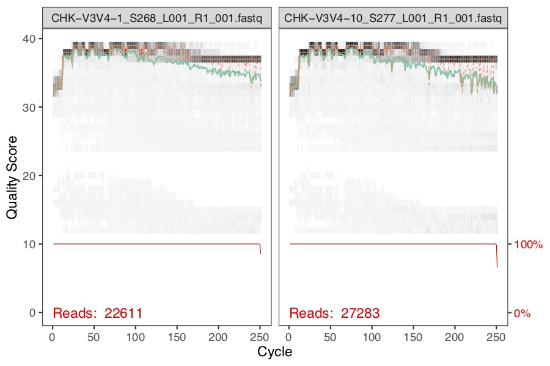
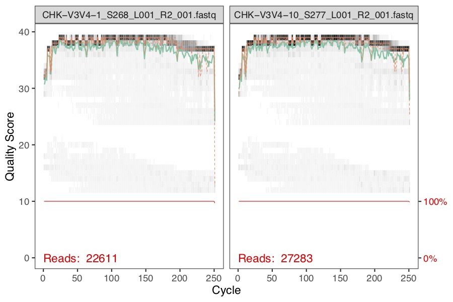
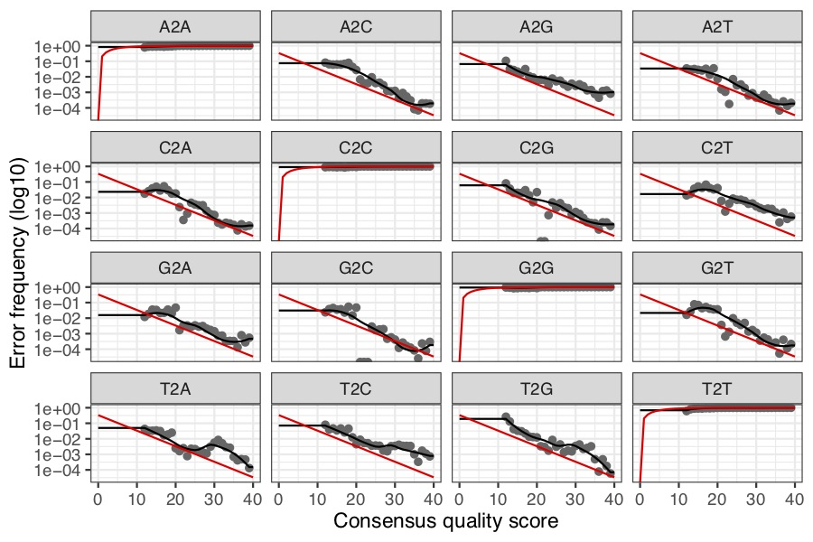
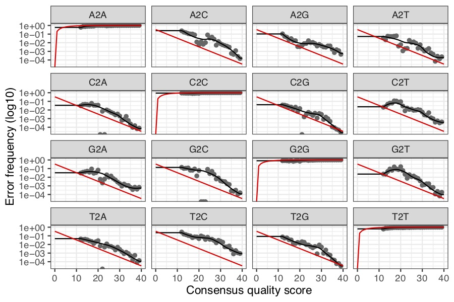
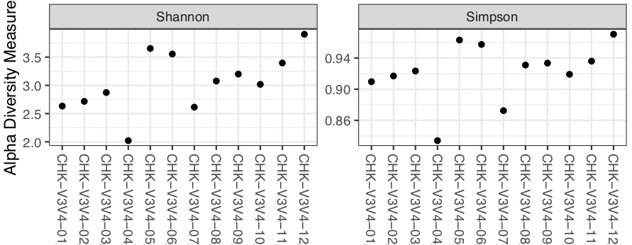
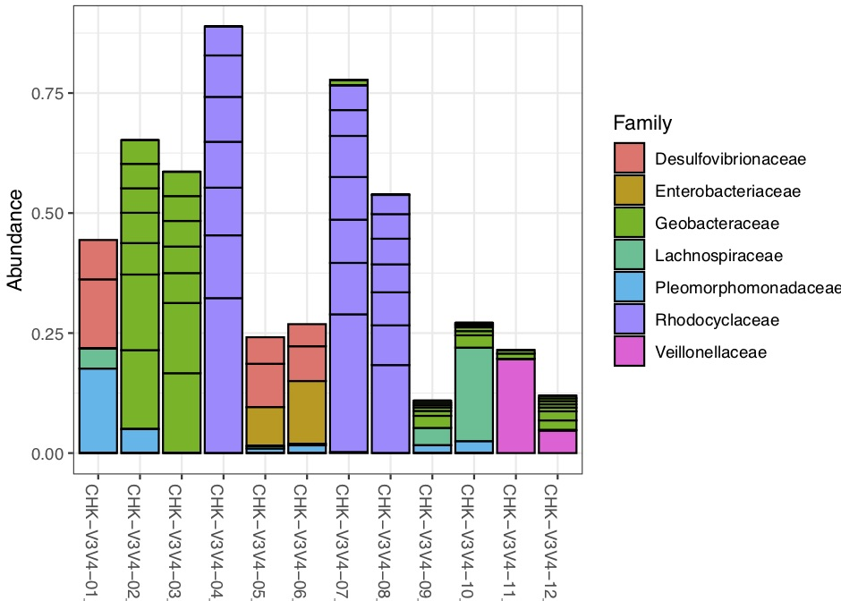

# Using DADA2 to analyse fastq files
## fastq file
A fastq file is build as follow : 
 
1. @ followed by the sequence id
2. the complete sequence  
3. \+  
4. The quality score for each nucleotid 

Forward and reverse fastq filenames have format: SAMPLENAME_R1_001.fastq and SAMPLENAME_R2_001.fastq

## samples
ARN 16S, V3 and V4 regions. 

## DADA2 pipeline [tuto](https://benjjneb.github.io/dada2/tutorial.html)
1. Read the quality profile. Reverse reads are usually of worse quality. We can consider trimming in this case.
2. Visualize the error rate for each nucleotides transition. 
3. Filter
3. Sample inference
4. Merged paired reads : alignment of forward and reverse sequences, if overlaps by at least 12 bases and are identical to each other in the overlaping region 
5. Construction of an ASV table (OTU-like table, with species based on 100% identity) (ASV or OTU, not clear)
6. Remove remaining chimeras 
7. Track reads trough the pipeline : may help to identify the steps where errors occur. 
8. Assign taxonomy. We use the Silva taxonomic training data formatted for DADA2 (Silva version 132)
9. Evaluate accuracy with a "mock comunity" if available (no mock community)

## Phyloseq - R package [tuto](https://benjjneb.github.io/dada2/tutorial.html)
In this tutorial, the code was built to compare 2 communities. Re adapt the code from the tutorial to fit the data.
 
1. **alpha-diversity**
= species richness.		
	- **shannon index**
	- **simpson index** - a measure of dominance, rather than diversity   "*these measures provide estimates of the effective number of species present, and differ only in their tendency to include or to ignore the relatively rarer species.*" - Hill, 1974

2. **beta-diversity**
It is a comparison of the diversity between samples. To mesure it, we use the Bray-Curtis distance. 

3. **family barplot**

## Results 
### The quality profile and error rate
seem ok 
 
 
 

### chimeras
60% of our merged sequences are chimeras (it is too much), is it beaucause of primers ?
### distribution of sequence lenght 
seem ok with a V3V4 region lenght
<pre><code> 298  420  424  439  440  441  442  443  444  450  459  460  461  464  465  466 
  20    2    9    2  236   29  115  318    2    1   32  441   32   37  970 2845 
 467 
   1 </code></pre>
   
### reading track
seem coherent 
<pre><code>            input filtered denoisedF denoisedR merged nonchim
CHK-V3V4-1  22611    20736     22418     22247  22081    6850
CHK-V3V4-10 27283    24798     26944     26867  26341    6391
CHK-V3V4-11 27790    25546     27369     27269  26383    8665
CHK-V3V4-12 27487    25309     26987     26767  25549    7726
CHK-V3V4-2  27079    25005     26921     26728  26593   15951
CHK-V3V4-3  33030    30500     32809     32545  32244   18034</code></pre>  

### taxonomy assignment
An overview of the most represented taxa.

<pre><code>     Kingdom    Phylum           Class                 Order                  
[1,] "Bacteria" "Proteobacteria" "Gammaproteobacteria" "Betaproteobacteriales"
[2,] "Bacteria" "Proteobacteria" "Deltaproteobacteria" "Desulfuromonadales"   
[3,] "Bacteria" "Proteobacteria" "Deltaproteobacteria" "Desulfuromonadales"   
[4,] "Bacteria" "Proteobacteria" "Gammaproteobacteria" "Betaproteobacteriales"
[5,] "Bacteria" "Proteobacteria" "Deltaproteobacteria" "Desulfovibrionales"   
[6,] "Bacteria" "Proteobacteria" "Gammaproteobacteria" "Betaproteobacteriales"
     Family                Genus           
[1,] "Rhodocyclaceae"      "Propionivibrio"
[2,] "Geobacteraceae"      "Geobacter"     
[3,] "Geobacteraceae"      "Geobacter"     
[4,] "Rhodocyclaceae"      "Propionivibrio"
[5,] "Desulfovibrionaceae" "Desulfovibrio" 
[6,] "Rhodocyclaceae"      "Propionivibrio" </code></pre>

### alpha diversity
 
### familly plot 
It seems that there is a wide viariability between the composition of each samples.
These results suggest that each samples don't come from the same community, but maybe were taken at different moments or places. 
 
