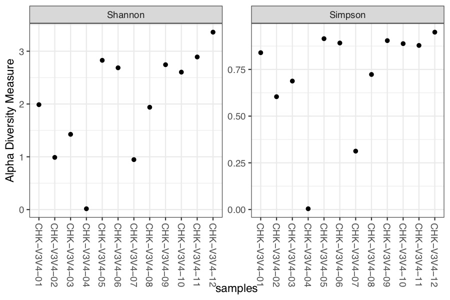
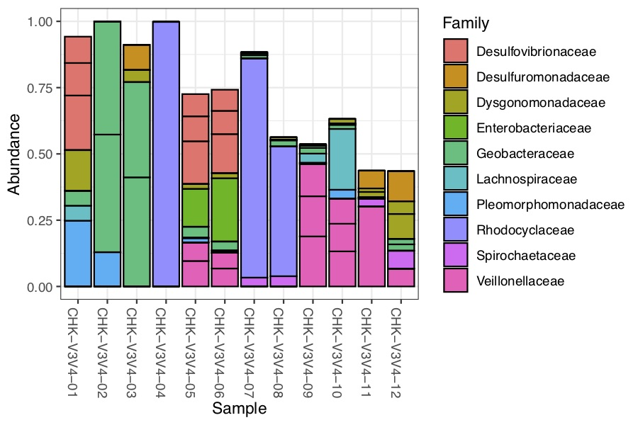

# Using DADA2 to analyse fastq files
See the article below for more information  
Callahan, B.J., McMurdie, P.J., Rosen, M.J., Han, A.W., Johnson, A.J.A., Holmes, S.P., 2016. **DADA2: High-resolution sample inference from Illumina amplicon data.** Nat Methods 13, 581–583. <https://doi.org/10.1038/nmeth.3869>
> **Abstract:** We present DADA2, a software package that models and corrects Illumina-sequenced amplicon errors. DADA2 infers sample sequences exactly, without coarse-graining into OTUs, and resolves differences of as little as one nucleotide. In several mock communities DADA2 identified more real variants and output fewer spurious sequences than other methods. We applied DADA2 to vaginal samples from a cohort of pregnant women, revealing a diversity of previously undetected *Lactobacillus crispatus* variants.

## fastq file
A fastq file is build as follow : 
 
1. @ followed by the sequence id
2. the complete sequence  
3. \+  
4. The quality score for each nucleotid 

Forward and reverse fastq filenames have format: SAMPLENAME_R1_001.fastq and SAMPLENAME_R2_001.fastq

## samples
ARN 16S, V3 and V4 regions. 

## DADA2 pipeline [tuto](https://benjjneb.github.io/dada2/tutorial.html)
1. Read the quality profile. Reverse reads are usually of worse quality. We can consider trimming in this case.
2. Visualize the error rate for each nucleotides transition. 
3. Filter
3. Sample inference
4. Merged paired reads : alignment of forward and reverse sequences, if overlaps by at least 12 bases and are identical to each other in the overlaping region 
5. Construction of an ASV table (OTU-like table, with species based on 100% identity) (ASV or OTU, not clear)
6. Remove remaining chimeras 
7. Track reads trough the pipeline : may help to identify the steps where errors occur. 
8. Assign taxonomy. We use the Silva taxonomic training data formatted for DADA2 (Silva version 132)
9. Evaluate accuracy with a "mock comunity" if available (no mock community)

## Phyloseq - R package [tuto](https://benjjneb.github.io/dada2/tutorial.html)
In this tutorial, the code was built to compare 2 communities. Re adapt the code from the tutorial to fit the data.
 
1. **alpha-diversity**
= species richness.		
	- **shannon index**
	- **simpson index** - a measure of dominance, rather than diversity   "*these measures provide estimates of the effective number of species present, and differ only in their tendency to include or to ignore the relatively rarer species.*" - Hill, 1974

2. **beta-diversity**
It is a comparison of the diversity between samples. To mesure it, we use the Bray-Curtis distance. 

3. **family barplot**

## Results 
### The quality profile and error rate
seem ok 
 
 
 

### chimeras
4% of our readings are chimeras : OK. 

### distribution of sequence lenght 
seem ok with a V3V4 region lenght
<pre><code>248 370 374 389 390 391 392 393 394 400 409 410 411 414 415 416 417 
  7   1   5   2  41   8  29  82   1   1   4  80   9  12 164 425   1 </code></pre>
   
### reading track
seem coherent 
<pre><code>            input filtered denoisedF denoisedR merged nonchim
CHK-V3V4-01 22611    20805     20780     20775  20753   20750
CHK-V3V4-02 27079    25072     25053     25060  25039   24998
CHK-V3V4-03 33030    30622     30577     30578  30464   30371
CHK-V3V4-04 29744    23557     23544     23541  23529   23529
CHK-V3V4-05 44204    40909     40674     40798  39093   37290
CHK-V3V4-06 23186    21446     21326     21383  20824   20324</code></pre>  

### taxonomy assignment
An overview of the most represented taxa.

<pre><code>   Kingdom    Phylum           Class                 Order                   Family                
[1,] "Bacteria" "Proteobacteria" "Gammaproteobacteria" "Betaproteobacteriales" "Rhodocyclaceae"      
[2,] "Bacteria" "Proteobacteria" "Deltaproteobacteria" "Desulfuromonadales"    "Geobacteraceae"      
[3,] "Bacteria" "Proteobacteria" "Deltaproteobacteria" "Desulfuromonadales"    "Geobacteraceae"      
[4,] "Bacteria" "Proteobacteria" "Deltaproteobacteria" "Desulfovibrionales"    "Desulfovibrionaceae" 
[5,] "Bacteria" "Proteobacteria" "Gammaproteobacteria" "Enterobacteriales"     "Enterobacteriaceae"  
[6,] "Bacteria" "Proteobacteria" "Alphaproteobacteria" "Rhizobiales"           "Pleomorphomonadaceae"
     Genus            
[1,] "Propionivibrio" 
[2,] "Geobacter"      
[3,] "Geobacter"      
[4,] "Desulfovibrio"  
[5,] NA               
[6,] "Pleomorphomonas" </code></pre>

### alpha diversity
 
<pre><code>Warning message:
In estimate_richness(physeq, split = TRUE, measures = measures) :
  The data you have provided does not have
any singletons. This is highly suspicious. Results of richness
estimates (for example) are probably unreliable, or wrong, if you have already
trimmed low-abundance taxa from the data.

We recommended that you find the un-trimmed data and retry.</code></pre> 
### familly plot 
It seems that there is a wide viariability between the composition of each samples.
These results suggest that each samples don't come from the same community, but maybe were taken at different moments or places. 
 
