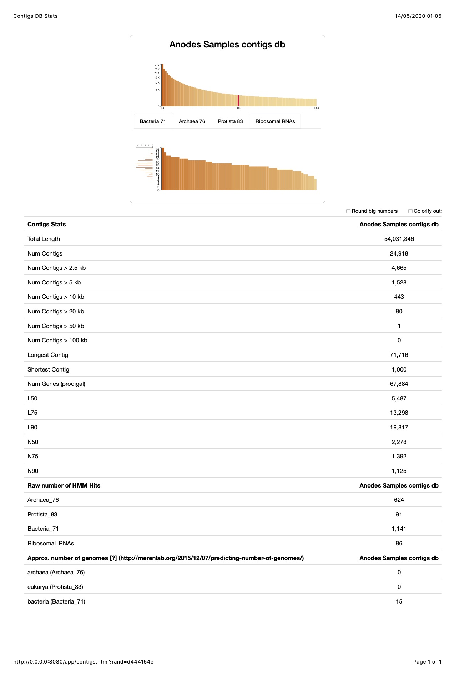
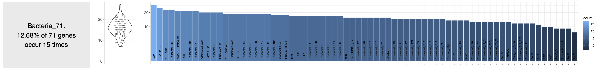
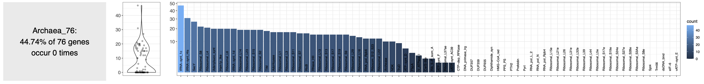
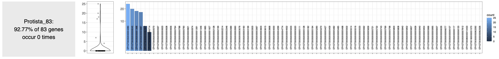
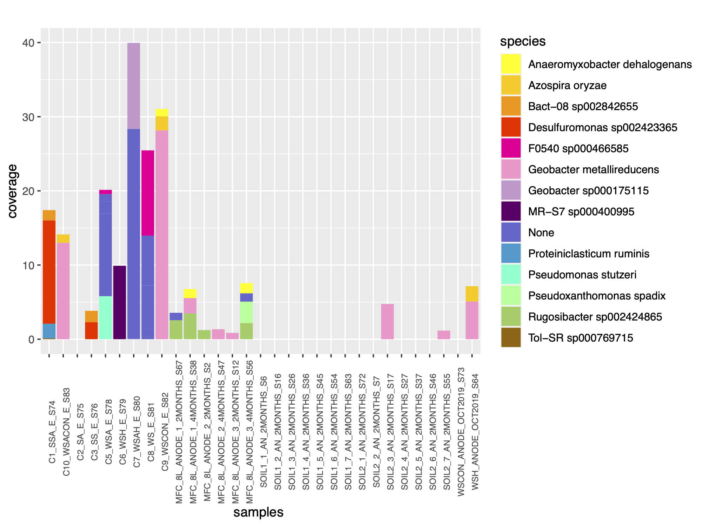
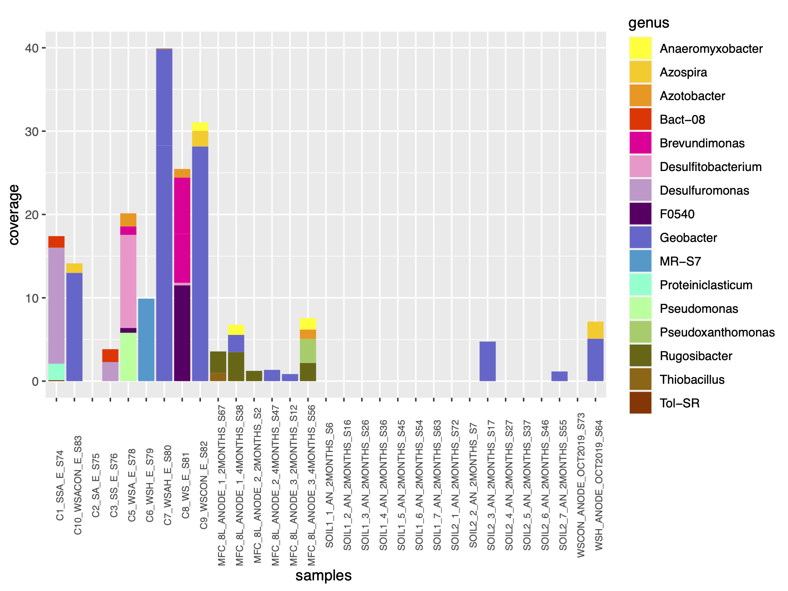

`conda activate anvio-master`
`anvi-activate-master`

# Generate MAGS from the anode samples 
## Assembly
[Tutorial on assembly-based metagenomics](http://merenlab.org/tutorials/assembly-based-metagenomics/)
### quality filtering 
```
01_QC/C1-SSA-E_S74-STATS.txt:total pairs passed            : 366623 (%92.01 of all pairs)
01_QC/C10-WSACon-E_S83-STATS.txt:total pairs passed            : 284960 (%92.27 of all pairs)
01_QC/C2-SA-E_S75-STATS.txt:total pairs passed            : 348323 (%91.07 of all pairs)
01_QC/C3-SS-E_S76-STATS.txt:total pairs passed            : 277604 (%92.98 of all pairs)
01_QC/C4-S-E_S77-STATS.txt:total pairs passed            : 306421 (%91.48 of all pairs)
01_QC/C5-WSA-E_S78-STATS.txt:total pairs passed            : 458066 (%93.50 of all pairs)
01_QC/C6-WSH-E_S79-STATS.txt:total pairs passed            : 380272 (%92.27 of all pairs)
01_QC/C7-WSAH-E_S80-STATS.txt:total pairs passed            : 349356 (%90.88 of all pairs)
01_QC/C8-WS-E_S81-STATS.txt:total pairs passed            : 370228 (%93.94 of all pairs)
01_QC/C9-WSCon-E_S82-STATS.txt:total pairs passed            : 444730 (%92.77 of all pairs)
01_QC/MFC-8L-anode-1-2months_S67-STATS.txt:total pairs passed            : 108650 (%93.72 of all pairs)
01_QC/MFC-8L-anode-1-4months_S38-STATS.txt:total pairs passed            : 159091 (%94.56 of all pairs)
01_QC/MFC-8L-anode-2-2months_S2-STATS.txt:total pairs passed            : 33218 (%93.66 of all pairs)
01_QC/MFC-8L-anode-2-4months_S47-STATS.txt:total pairs passed            : 159314 (%94.08 of all pairs)
01_QC/MFC-8L-anode-3-2months_S12-STATS.txt:total pairs passed            : 49036 (%94.16 of all pairs)
01_QC/MFC-8L-anode-3-4months_S56-STATS.txt:total pairs passed            : 121436 (%94.50 of all pairs)
01_QC/Soil1-1-AN-2months_S6-STATS.txt:total pairs passed            : 4933 (%97.76 of all pairs)
01_QC/Soil1-2-AN-2months_S16-STATS.txt:total pairs passed            : 6345 (%96.83 of all pairs)
01_QC/Soil1-3-AN-2months_S26-STATS.txt:total pairs passed            : 9347 (%94.26 of all pairs)
01_QC/Soil1-4-AN-2months_S36-STATS.txt:total pairs passed            : 7654 (%95.83 of all pairs)
01_QC/Soil1-5-AN-2months_S45-STATS.txt:total pairs passed            : 107 (%95.54 of all pairs)
01_QC/Soil1-6-AN-2months_S54-STATS.txt:total pairs passed            : 28398 (%94.93 of all pairs)
01_QC/Soil1-7-AN-2months_S63-STATS.txt:total pairs passed            : 11187 (%94.86 of all pairs)
01_QC/Soil2-1-AN-2months_S72-STATS.txt:total pairs passed            : 206 (%95.37 of all pairs)
01_QC/Soil2-2-AN-2months_S7-STATS.txt:total pairs passed            : 1211 (%90.44 of all pairs)
01_QC/Soil2-3-AN-2months_S17-STATS.txt:total pairs passed            : 57394 (%94.31 of all pairs)
01_QC/Soil2-4-AN-2months_S27-STATS.txt:total pairs passed            : 3974 (%93.02 of all pairs)
01_QC/Soil2-5-AN-2months_S37-STATS.txt:total pairs passed            : 2279 (%93.29 of all pairs)
01_QC/Soil2-6-AN-2months_S46-STATS.txt:total pairs passed            : 351 (%82.01 of all pairs)
01_QC/Soil2-7-AN-2months_S55-STATS.txt:total pairs passed            : 2443 (%93.93 of all pairs)
01_QC/WSCon-anode-Oct2019_S73-STATS.txt:total pairs passed            : 93834 (%93.72 of all pairs)
01_QC/WSH-anode-Oct2019_S64-STATS.txt:total pairs passed            : 147324 (%95.05 of all pairs)
```

### Co-assembly
with megahit

```
2020-05-13 19:21:02 - b'INFO  main_assemble.cpp             :  211 - Number of complex bubbles removed: 0, Time elapsed(sec): 0.093782'
2020-05-13 19:21:02 - b'INFO  main_assemble.cpp             :  222 - Number unitigs disconnected: 0, time: 0.077'
2020-05-13 19:21:02 - b'INFO  main_assemble.cpp             :  246 - Unitigs removed in excessive pruning: 0, time: 0.002'
2020-05-13 19:21:02 - b'INFO  assembly/contig_stat.h        :   40 - Max: 71716, Min: 142, N50: 839, number contigs: 149804, number isolated: 145225, number looped: 239, total size: 127446058,'
2020-05-13 19:21:02 - b'INFO  main_assemble.cpp             :  289 - Number of local low depth unitigs removed: 185, complex bubbles removed: 6, time: 0.469372'
2020-05-13 19:21:02 - b'INFO  assembly/contig_stat.h        :   40 - Max: 71716, Min: 142, N50: 840, number contigs: 149323, number isolated: 145307, number looped: 239, total size: 127353829,'
2020-05-13 19:21:23 - b'INFO  utils/utils.h                 :  152 - Real: 222.3141\tuser: 791.7172\tsys: 2.0661\tmaxrss: 578105344'
2020-05-13 19:21:23 - Merging to output final contigs 
2020-05-13 19:21:23 - 24918 contigs, total 54031346 bp, min 1000 bp, max 71716 bp, avg 2168 bp, N50 2278 bp
```
contigs.fa: 

```
Minimum length ...............................: 1,000
Max % gaps allowed ...........................: 100.00%
Total num contigs ............................: 24,918
Total num nucleotides ........................: 54,031,346
```
### Mapping 
Add the missing parentheses into the .sh 

```
366623 reads; of these:
  366623 (100.00%) were paired; of these:
    246322 (67.19%) aligned concordantly 0 times
    111168 (30.32%) aligned concordantly exactly 1 time
    9133 (2.49%) aligned concordantly >1 times
    ----
    246322 pairs aligned concordantly 0 times; of these:
      4796 (1.95%) aligned discordantly 1 time
    ----
    241526 pairs aligned 0 times concordantly or discordantly; of these:
      483052 mates make up the pairs; of these:
        479163 (99.19%) aligned 0 times
        2966 (0.61%) aligned exactly 1 time
        923 (0.19%) aligned >1 times
34.65% overall alignment rate
Sorted BAM File ..............................: /Users/euphrasieservant/Documents/internship_ecl/EMW/Assembly/04_MAPPING/C1-SSA-E_S74.bam
BAM File Index ...............................: /Users/euphrasieservant/Documents/internship_ecl/EMW/Assembly/04_MAPPING/C1-SSA-E_S74.bam.bai
284960 reads; of these:
  284960 (100.00%) were paired; of these:
    160070 (56.17%) aligned concordantly 0 times
    66905 (23.48%) aligned concordantly exactly 1 time
    57985 (20.35%) aligned concordantly >1 times
    ----
    160070 pairs aligned concordantly 0 times; of these:
      2181 (1.36%) aligned discordantly 1 time
    ----
    157889 pairs aligned 0 times concordantly or discordantly; of these:
      315778 mates make up the pairs; of these:
        308290 (97.63%) aligned 0 times
        2765 (0.88%) aligned exactly 1 time
        4723 (1.50%) aligned >1 times
45.91% overall alignment rate
Sorted BAM File ..............................: /Users/euphrasieservant/Documents/internship_ecl/EMW/Assembly/04_MAPPING/C10-WSACon-E_S83.bam
BAM File Index ...............................: /Users/euphrasieservant/Documents/internship_ecl/EMW/Assembly/04_MAPPING/C10-WSACon-E_S83.bam.bai
348323 reads; of these:
  348323 (100.00%) were paired; of these:
    229254 (65.82%) aligned concordantly 0 times
    110235 (31.65%) aligned concordantly exactly 1 time
    8834 (2.54%) aligned concordantly >1 times
    ----
    229254 pairs aligned concordantly 0 times; of these:
      4925 (2.15%) aligned discordantly 1 time
    ----
    224329 pairs aligned 0 times concordantly or discordantly; of these:
      448658 mates make up the pairs; of these:
        444670 (99.11%) aligned 0 times
        3184 (0.71%) aligned exactly 1 time
        804 (0.18%) aligned >1 times
36.17% overall alignment rate
Sorted BAM File ..............................: /Users/euphrasieservant/Documents/internship_ecl/EMW/Assembly/04_MAPPING/C2-SA-E_S75.bam
BAM File Index ...............................: /Users/euphrasieservant/Documents/internship_ecl/EMW/Assembly/04_MAPPING/C2-SA-E_S75.bam.bai
277604 reads; of these:
  277604 (100.00%) were paired; of these:
    231331 (83.33%) aligned concordantly 0 times
    44400 (15.99%) aligned concordantly exactly 1 time
    1873 (0.67%) aligned concordantly >1 times
    ----
    231331 pairs aligned concordantly 0 times; of these:
      2385 (1.03%) aligned discordantly 1 time
    ----
    228946 pairs aligned 0 times concordantly or discordantly; of these:
      457892 mates make up the pairs; of these:
        456153 (99.62%) aligned 0 times
        1540 (0.34%) aligned exactly 1 time
        199 (0.04%) aligned >1 times
17.84% overall alignment rate
Sorted BAM File ..............................: /Users/euphrasieservant/Documents/internship_ecl/EMW/Assembly/04_MAPPING/C3-SS-E_S76.bam
BAM File Index ...............................: /Users/euphrasieservant/Documents/internship_ecl/EMW/Assembly/04_MAPPING/C3-SS-E_S76.bam.bai
306421 reads; of these:
  306421 (100.00%) were paired; of these:
    279533 (91.23%) aligned concordantly 0 times
    25959 (8.47%) aligned concordantly exactly 1 time
    929 (0.30%) aligned concordantly >1 times
    ----
    279533 pairs aligned concordantly 0 times; of these:
      1361 (0.49%) aligned discordantly 1 time
    ----
    278172 pairs aligned 0 times concordantly or discordantly; of these:
      556344 mates make up the pairs; of these:
        554788 (99.72%) aligned 0 times
        1422 (0.26%) aligned exactly 1 time
        134 (0.02%) aligned >1 times
9.47% overall alignment rate
Sorted BAM File ..............................: /Users/euphrasieservant/Documents/internship_ecl/EMW/Assembly/04_MAPPING/C4-S-E_S77.bam
BAM File Index ...............................: /Users/euphrasieservant/Documents/internship_ecl/EMW/Assembly/04_MAPPING/C4-S-E_S77.bam.bai
458066 reads; of these:
  458066 (100.00%) were paired; of these:
    325915 (71.15%) aligned concordantly 0 times
    125591 (27.42%) aligned concordantly exactly 1 time
    6560 (1.43%) aligned concordantly >1 times
    ----
    325915 pairs aligned concordantly 0 times; of these:
      4016 (1.23%) aligned discordantly 1 time
    ----
    321899 pairs aligned 0 times concordantly or discordantly; of these:
      643798 mates make up the pairs; of these:
        639824 (99.38%) aligned 0 times
        3356 (0.52%) aligned exactly 1 time
        618 (0.10%) aligned >1 times
30.16% overall alignment rate
Sorted BAM File ..............................: /Users/euphrasieservant/Documents/internship_ecl/EMW/Assembly/04_MAPPING/C5-WSA-E_S78.bam
BAM File Index ...............................: /Users/euphrasieservant/Documents/internship_ecl/EMW/Assembly/04_MAPPING/C5-WSA-E_S78.bam.bai
380272 reads; of these:
  380272 (100.00%) were paired; of these:
    310975 (81.78%) aligned concordantly 0 times
    66595 (17.51%) aligned concordantly exactly 1 time
    2702 (0.71%) aligned concordantly >1 times
    ----
    310975 pairs aligned concordantly 0 times; of these:
      3142 (1.01%) aligned discordantly 1 time
    ----
    307833 pairs aligned 0 times concordantly or discordantly; of these:
      615666 mates make up the pairs; of these:
        612838 (99.54%) aligned 0 times
        2544 (0.41%) aligned exactly 1 time
        284 (0.05%) aligned >1 times
19.42% overall alignment rate
Sorted BAM File ..............................: /Users/euphrasieservant/Documents/internship_ecl/EMW/Assembly/04_MAPPING/C6-WSH-E_S79.bam
BAM File Index ...............................: /Users/euphrasieservant/Documents/internship_ecl/EMW/Assembly/04_MAPPING/C6-WSH-E_S79.bam.bai
349356 reads; of these:
  349356 (100.00%) were paired; of these:
    64848 (18.56%) aligned concordantly 0 times
    263057 (75.30%) aligned concordantly exactly 1 time
    21451 (6.14%) aligned concordantly >1 times
    ----
    64848 pairs aligned concordantly 0 times; of these:
      11603 (17.89%) aligned discordantly 1 time
    ----
    53245 pairs aligned 0 times concordantly or discordantly; of these:
      106490 mates make up the pairs; of these:
        100205 (94.10%) aligned 0 times
        4441 (4.17%) aligned exactly 1 time
        1844 (1.73%) aligned >1 times
85.66% overall alignment rate
Sorted BAM File ..............................: /Users/euphrasieservant/Documents/internship_ecl/EMW/Assembly/04_MAPPING/C7-WSAH-E_S80.bam
BAM File Index ...............................: /Users/euphrasieservant/Documents/internship_ecl/EMW/Assembly/04_MAPPING/C7-WSAH-E_S80.bam.bai
370228 reads; of these:
  370228 (100.00%) were paired; of these:
    291362 (78.70%) aligned concordantly 0 times
    74239 (20.05%) aligned concordantly exactly 1 time
    4627 (1.25%) aligned concordantly >1 times
    ----
    291362 pairs aligned concordantly 0 times; of these:
      3464 (1.19%) aligned discordantly 1 time
    ----
    287898 pairs aligned 0 times concordantly or discordantly; of these:
      575796 mates make up the pairs; of these:
        572267 (99.39%) aligned 0 times
        3024 (0.53%) aligned exactly 1 time
        505 (0.09%) aligned >1 times
22.71% overall alignment rate
Sorted BAM File ..............................: /Users/euphrasieservant/Documents/internship_ecl/EMW/Assembly/04_MAPPING/C8-WS-E_S81.bam
BAM File Index ...............................: /Users/euphrasieservant/Documents/internship_ecl/EMW/Assembly/04_MAPPING/C8-WS-E_S81.bam.bai
444730 reads; of these:
  444730 (100.00%) were paired; of these:
    134266 (30.19%) aligned concordantly 0 times
    149722 (33.67%) aligned concordantly exactly 1 time
    160742 (36.14%) aligned concordantly >1 times
    ----
    134266 pairs aligned concordantly 0 times; of these:
      4239 (3.16%) aligned discordantly 1 time
    ----
    130027 pairs aligned 0 times concordantly or discordantly; of these:
      260054 mates make up the pairs; of these:
        242505 (93.25%) aligned 0 times
        4990 (1.92%) aligned exactly 1 time
        12559 (4.83%) aligned >1 times
72.74% overall alignment rate
Sorted BAM File ..............................: /Users/euphrasieservant/Documents/internship_ecl/EMW/Assembly/04_MAPPING/C9-WSCon-E_S82.bam
BAM File Index ...............................: /Users/euphrasieservant/Documents/internship_ecl/EMW/Assembly/04_MAPPING/C9-WSCon-E_S82.bam.bai
108650 reads; of these:
  108650 (100.00%) were paired; of these:
    93079 (85.67%) aligned concordantly 0 times
    14697 (13.53%) aligned concordantly exactly 1 time
    874 (0.80%) aligned concordantly >1 times
    ----
    93079 pairs aligned concordantly 0 times; of these:
      992 (1.07%) aligned discordantly 1 time
    ----
    92087 pairs aligned 0 times concordantly or discordantly; of these:
      184174 mates make up the pairs; of these:
        183049 (99.39%) aligned 0 times
        966 (0.52%) aligned exactly 1 time
        159 (0.09%) aligned >1 times
15.76% overall alignment rate
Sorted BAM File ..............................: /Users/euphrasieservant/Documents/internship_ecl/EMW/Assembly/04_MAPPING/MFC-8L-anode-1-2months_S67.bam
BAM File Index ...............................: /Users/euphrasieservant/Documents/internship_ecl/EMW/Assembly/04_MAPPING/MFC-8L-anode-1-2months_S67.bam.bai
159091 reads; of these:
  159091 (100.00%) were paired; of these:
    113135 (71.11%) aligned concordantly 0 times
    39730 (24.97%) aligned concordantly exactly 1 time
    6226 (3.91%) aligned concordantly >1 times
    ----
    113135 pairs aligned concordantly 0 times; of these:
      2911 (2.57%) aligned discordantly 1 time
    ----
    110224 pairs aligned 0 times concordantly or discordantly; of these:
      220448 mates make up the pairs; of these:
        217958 (98.87%) aligned 0 times
        1475 (0.67%) aligned exactly 1 time
        1015 (0.46%) aligned >1 times
31.50% overall alignment rate
Sorted BAM File ..............................: /Users/euphrasieservant/Documents/internship_ecl/EMW/Assembly/04_MAPPING/MFC-8L-anode-1-4months_S38.bam
BAM File Index ...............................: /Users/euphrasieservant/Documents/internship_ecl/EMW/Assembly/04_MAPPING/MFC-8L-anode-1-4months_S38.bam.bai
33218 reads; of these:
  33218 (100.00%) were paired; of these:
    28765 (86.59%) aligned concordantly 0 times
    4172 (12.56%) aligned concordantly exactly 1 time
    281 (0.85%) aligned concordantly >1 times
    ----
    28765 pairs aligned concordantly 0 times; of these:
      592 (2.06%) aligned discordantly 1 time
    ----
    28173 pairs aligned 0 times concordantly or discordantly; of these:
      56346 mates make up the pairs; of these:
        55802 (99.03%) aligned 0 times
        435 (0.77%) aligned exactly 1 time
        109 (0.19%) aligned >1 times
16.01% overall alignment rate
Sorted BAM File ..............................: /Users/euphrasieservant/Documents/internship_ecl/EMW/Assembly/04_MAPPING/MFC-8L-anode-2-2months_S2.bam
BAM File Index ...............................: /Users/euphrasieservant/Documents/internship_ecl/EMW/Assembly/04_MAPPING/MFC-8L-anode-2-2months_S2.bam.bai
159314 reads; of these:
  159314 (100.00%) were paired; of these:
    137091 (86.05%) aligned concordantly 0 times
    14349 (9.01%) aligned concordantly exactly 1 time
    7874 (4.94%) aligned concordantly >1 times
    ----
    137091 pairs aligned concordantly 0 times; of these:
      1092 (0.80%) aligned discordantly 1 time
    ----
    135999 pairs aligned 0 times concordantly or discordantly; of these:
      271998 mates make up the pairs; of these:
        269242 (98.99%) aligned 0 times
        1381 (0.51%) aligned exactly 1 time
        1375 (0.51%) aligned >1 times
15.50% overall alignment rate
Sorted BAM File ..............................: /Users/euphrasieservant/Documents/internship_ecl/EMW/Assembly/04_MAPPING/MFC-8L-anode-2-4months_S47.bam
BAM File Index ...............................: /Users/euphrasieservant/Documents/internship_ecl/EMW/Assembly/04_MAPPING/MFC-8L-anode-2-4months_S47.bam.bai
49036 reads; of these:
  49036 (100.00%) were paired; of these:
    42042 (85.74%) aligned concordantly 0 times
    6196 (12.64%) aligned concordantly exactly 1 time
    798 (1.63%) aligned concordantly >1 times
    ----
    42042 pairs aligned concordantly 0 times; of these:
      1054 (2.51%) aligned discordantly 1 time
    ----
    40988 pairs aligned 0 times concordantly or discordantly; of these:
      81976 mates make up the pairs; of these:
        80788 (98.55%) aligned 0 times
        801 (0.98%) aligned exactly 1 time
        387 (0.47%) aligned >1 times
17.62% overall alignment rate
Sorted BAM File ..............................: /Users/euphrasieservant/Documents/internship_ecl/EMW/Assembly/04_MAPPING/MFC-8L-anode-3-2months_S12.bam
BAM File Index ...............................: /Users/euphrasieservant/Documents/internship_ecl/EMW/Assembly/04_MAPPING/MFC-8L-anode-3-2months_S12.bam.bai
121436 reads; of these:
  121436 (100.00%) were paired; of these:
    102149 (84.12%) aligned concordantly 0 times
    18192 (14.98%) aligned concordantly exactly 1 time
    1095 (0.90%) aligned concordantly >1 times
    ----
    102149 pairs aligned concordantly 0 times; of these:
      1672 (1.64%) aligned discordantly 1 time
    ----
    100477 pairs aligned 0 times concordantly or discordantly; of these:
      200954 mates make up the pairs; of these:
        199655 (99.35%) aligned 0 times
        1041 (0.52%) aligned exactly 1 time
        258 (0.13%) aligned >1 times
17.79% overall alignment rate
Sorted BAM File ..............................: /Users/euphrasieservant/Documents/internship_ecl/EMW/Assembly/04_MAPPING/MFC-8L-anode-3-4months_S56.bam
BAM File Index ...............................: /Users/euphrasieservant/Documents/internship_ecl/EMW/Assembly/04_MAPPING/MFC-8L-anode-3-4months_S56.bam.bai
4933 reads; of these:
  4933 (100.00%) were paired; of these:
    4928 (99.90%) aligned concordantly 0 times
    0 (0.00%) aligned concordantly exactly 1 time
    5 (0.10%) aligned concordantly >1 times
    ----
    4928 pairs aligned concordantly 0 times; of these:
      0 (0.00%) aligned discordantly 1 time
    ----
    4928 pairs aligned 0 times concordantly or discordantly; of these:
      9856 mates make up the pairs; of these:
        9851 (99.95%) aligned 0 times
        4 (0.04%) aligned exactly 1 time
        1 (0.01%) aligned >1 times
0.15% overall alignment rate
Sorted BAM File ..............................: /Users/euphrasieservant/Documents/internship_ecl/EMW/Assembly/04_MAPPING/Soil1-1-AN-2months_S6.bam
BAM File Index ...............................: /Users/euphrasieservant/Documents/internship_ecl/EMW/Assembly/04_MAPPING/Soil1-1-AN-2months_S6.bam.bai
6345 reads; of these:
  6345 (100.00%) were paired; of these:
    6339 (99.91%) aligned concordantly 0 times
    3 (0.05%) aligned concordantly exactly 1 time
    3 (0.05%) aligned concordantly >1 times
    ----
    6339 pairs aligned concordantly 0 times; of these:
      0 (0.00%) aligned discordantly 1 time
    ----
    6339 pairs aligned 0 times concordantly or discordantly; of these:
      12678 mates make up the pairs; of these:
        12674 (99.97%) aligned 0 times
        1 (0.01%) aligned exactly 1 time
        3 (0.02%) aligned >1 times
0.13% overall alignment rate
Sorted BAM File ..............................: /Users/euphrasieservant/Documents/internship_ecl/EMW/Assembly/04_MAPPING/Soil1-2-AN-2months_S16.bam
BAM File Index ...............................: /Users/euphrasieservant/Documents/internship_ecl/EMW/Assembly/04_MAPPING/Soil1-2-AN-2months_S16.bam.bai
9347 reads; of these:
  9347 (100.00%) were paired; of these:
    7188 (76.90%) aligned concordantly 0 times
    1019 (10.90%) aligned concordantly exactly 1 time
    1140 (12.20%) aligned concordantly >1 times
    ----
    7188 pairs aligned concordantly 0 times; of these:
      38 (0.53%) aligned discordantly 1 time
    ----
    7150 pairs aligned 0 times concordantly or discordantly; of these:
      14300 mates make up the pairs; of these:
        14167 (99.07%) aligned 0 times
        51 (0.36%) aligned exactly 1 time
        82 (0.57%) aligned >1 times
24.22% overall alignment rate
Sorted BAM File ..............................: /Users/euphrasieservant/Documents/internship_ecl/EMW/Assembly/04_MAPPING/Soil1-3-AN-2months_S26.bam
BAM File Index ...............................: /Users/euphrasieservant/Documents/internship_ecl/EMW/Assembly/04_MAPPING/Soil1-3-AN-2months_S26.bam.bai
7654 reads; of these:
  7654 (100.00%) were paired; of these:
    7558 (98.75%) aligned concordantly 0 times
    49 (0.64%) aligned concordantly exactly 1 time
    47 (0.61%) aligned concordantly >1 times
    ----
    7558 pairs aligned concordantly 0 times; of these:
      0 (0.00%) aligned discordantly 1 time
    ----
    7558 pairs aligned 0 times concordantly or discordantly; of these:
      15116 mates make up the pairs; of these:
        15109 (99.95%) aligned 0 times
        4 (0.03%) aligned exactly 1 time
        3 (0.02%) aligned >1 times
1.30% overall alignment rate
Sorted BAM File ..............................: /Users/euphrasieservant/Documents/internship_ecl/EMW/Assembly/04_MAPPING/Soil1-4-AN-2months_S36.bam
BAM File Index ...............................: /Users/euphrasieservant/Documents/internship_ecl/EMW/Assembly/04_MAPPING/Soil1-4-AN-2months_S36.bam.bai
107 reads; of these:
  107 (100.00%) were paired; of these:
    103 (96.26%) aligned concordantly 0 times
    3 (2.80%) aligned concordantly exactly 1 time
    1 (0.93%) aligned concordantly >1 times
    ----
    103 pairs aligned concordantly 0 times; of these:
      0 (0.00%) aligned discordantly 1 time
    ----
    103 pairs aligned 0 times concordantly or discordantly; of these:
      206 mates make up the pairs; of these:
        206 (100.00%) aligned 0 times
        0 (0.00%) aligned exactly 1 time
        0 (0.00%) aligned >1 times
3.74% overall alignment rate
Sorted BAM File ..............................: /Users/euphrasieservant/Documents/internship_ecl/EMW/Assembly/04_MAPPING/Soil1-5-AN-2months_S45.bam
BAM File Index ...............................: /Users/euphrasieservant/Documents/internship_ecl/EMW/Assembly/04_MAPPING/Soil1-5-AN-2months_S45.bam.bai
28398 reads; of these:
  28398 (100.00%) were paired; of these:
    18425 (64.88%) aligned concordantly 0 times
    4446 (15.66%) aligned concordantly exactly 1 time
    5527 (19.46%) aligned concordantly >1 times
    ----
    18425 pairs aligned concordantly 0 times; of these:
      154 (0.84%) aligned discordantly 1 time
    ----
    18271 pairs aligned 0 times concordantly or discordantly; of these:
      36542 mates make up the pairs; of these:
        35900 (98.24%) aligned 0 times
        211 (0.58%) aligned exactly 1 time
        431 (1.18%) aligned >1 times
36.79% overall alignment rate
Sorted BAM File ..............................: /Users/euphrasieservant/Documents/internship_ecl/EMW/Assembly/04_MAPPING/Soil1-6-AN-2months_S54.bam
BAM File Index ...............................: /Users/euphrasieservant/Documents/internship_ecl/EMW/Assembly/04_MAPPING/Soil1-6-AN-2months_S54.bam.bai
11187 reads; of these:
  11187 (100.00%) were paired; of these:
    6242 (55.80%) aligned concordantly 0 times
    2115 (18.91%) aligned concordantly exactly 1 time
    2830 (25.30%) aligned concordantly >1 times
    ----
    6242 pairs aligned concordantly 0 times; of these:
      67 (1.07%) aligned discordantly 1 time
    ----
    6175 pairs aligned 0 times concordantly or discordantly; of these:
      12350 mates make up the pairs; of these:
        11992 (97.10%) aligned 0 times
        129 (1.04%) aligned exactly 1 time
        229 (1.85%) aligned >1 times
46.40% overall alignment rate
Sorted BAM File ..............................: /Users/euphrasieservant/Documents/internship_ecl/EMW/Assembly/04_MAPPING/Soil1-7-AN-2months_S63.bam
BAM File Index ...............................: /Users/euphrasieservant/Documents/internship_ecl/EMW/Assembly/04_MAPPING/Soil1-7-AN-2months_S63.bam.bai
206 reads; of these:
  206 (100.00%) were paired; of these:
    201 (97.57%) aligned concordantly 0 times
    5 (2.43%) aligned concordantly exactly 1 time
    0 (0.00%) aligned concordantly >1 times
    ----
    201 pairs aligned concordantly 0 times; of these:
      0 (0.00%) aligned discordantly 1 time
    ----
    201 pairs aligned 0 times concordantly or discordantly; of these:
      402 mates make up the pairs; of these:
        402 (100.00%) aligned 0 times
        0 (0.00%) aligned exactly 1 time
        0 (0.00%) aligned >1 times
2.43% overall alignment rate
Sorted BAM File ..............................: /Users/euphrasieservant/Documents/internship_ecl/EMW/Assembly/04_MAPPING/Soil2-1-AN-2months_S72.bam
BAM File Index ...............................: /Users/euphrasieservant/Documents/internship_ecl/EMW/Assembly/04_MAPPING/Soil2-1-AN-2months_S72.bam.bai
1211 reads; of these:
  1211 (100.00%) were paired; of these:
    1211 (100.00%) aligned concordantly 0 times
    0 (0.00%) aligned concordantly exactly 1 time
    0 (0.00%) aligned concordantly >1 times
    ----
    1211 pairs aligned concordantly 0 times; of these:
      0 (0.00%) aligned discordantly 1 time
    ----
    1211 pairs aligned 0 times concordantly or discordantly; of these:
      2422 mates make up the pairs; of these:
        2421 (99.96%) aligned 0 times
        1 (0.04%) aligned exactly 1 time
        0 (0.00%) aligned >1 times
0.04% overall alignment rate
Sorted BAM File ..............................: /Users/euphrasieservant/Documents/internship_ecl/EMW/Assembly/04_MAPPING/Soil2-2-AN-2months_S7.bam
BAM File Index ...............................: /Users/euphrasieservant/Documents/internship_ecl/EMW/Assembly/04_MAPPING/Soil2-2-AN-2months_S7.bam.bai
57394 reads; of these:
  57394 (100.00%) were paired; of these:
    21958 (38.26%) aligned concordantly 0 times
    16080 (28.02%) aligned concordantly exactly 1 time
    19356 (33.72%) aligned concordantly >1 times
    ----
    21958 pairs aligned concordantly 0 times; of these:
      1491 (6.79%) aligned discordantly 1 time
    ----
    20467 pairs aligned 0 times concordantly or discordantly; of these:
      40934 mates make up the pairs; of these:
        33324 (81.41%) aligned 0 times
        2096 (5.12%) aligned exactly 1 time
        5514 (13.47%) aligned >1 times
70.97% overall alignment rate
Sorted BAM File ..............................: /Users/euphrasieservant/Documents/internship_ecl/EMW/Assembly/04_MAPPING/Soil2-3-AN-2months_S17.bam
BAM File Index ...............................: /Users/euphrasieservant/Documents/internship_ecl/EMW/Assembly/04_MAPPING/Soil2-3-AN-2months_S17.bam.bai
3974 reads; of these:
  3974 (100.00%) were paired; of these:
    3655 (91.97%) aligned concordantly 0 times
    161 (4.05%) aligned concordantly exactly 1 time
    158 (3.98%) aligned concordantly >1 times
    ----
    3655 pairs aligned concordantly 0 times; of these:
      6 (0.16%) aligned discordantly 1 time
    ----
    3649 pairs aligned 0 times concordantly or discordantly; of these:
      7298 mates make up the pairs; of these:
        7287 (99.85%) aligned 0 times
        5 (0.07%) aligned exactly 1 time
        6 (0.08%) aligned >1 times
8.32% overall alignment rate
Sorted BAM File ..............................: /Users/euphrasieservant/Documents/internship_ecl/EMW/Assembly/04_MAPPING/Soil2-4-AN-2months_S27.bam
BAM File Index ...............................: /Users/euphrasieservant/Documents/internship_ecl/EMW/Assembly/04_MAPPING/Soil2-4-AN-2months_S27.bam.bai
2279 reads; of these:
  2279 (100.00%) were paired; of these:
    1231 (54.01%) aligned concordantly 0 times
    467 (20.49%) aligned concordantly exactly 1 time
    581 (25.49%) aligned concordantly >1 times
    ----
    1231 pairs aligned concordantly 0 times; of these:
      16 (1.30%) aligned discordantly 1 time
    ----
    1215 pairs aligned 0 times concordantly or discordantly; of these:
      2430 mates make up the pairs; of these:
        2391 (98.40%) aligned 0 times
        12 (0.49%) aligned exactly 1 time
        27 (1.11%) aligned >1 times
47.54% overall alignment rate
Sorted BAM File ..............................: /Users/euphrasieservant/Documents/internship_ecl/EMW/Assembly/04_MAPPING/Soil2-5-AN-2months_S37.bam
BAM File Index ...............................: /Users/euphrasieservant/Documents/internship_ecl/EMW/Assembly/04_MAPPING/Soil2-5-AN-2months_S37.bam.bai
351 reads; of these:
  351 (100.00%) were paired; of these:
    263 (74.93%) aligned concordantly 0 times
    40 (11.40%) aligned concordantly exactly 1 time
    48 (13.68%) aligned concordantly >1 times
    ----
    263 pairs aligned concordantly 0 times; of these:
      1 (0.38%) aligned discordantly 1 time
    ----
    262 pairs aligned 0 times concordantly or discordantly; of these:
      524 mates make up the pairs; of these:
        517 (98.66%) aligned 0 times
        2 (0.38%) aligned exactly 1 time
        5 (0.95%) aligned >1 times
26.35% overall alignment rate
Sorted BAM File ..............................: /Users/euphrasieservant/Documents/internship_ecl/EMW/Assembly/04_MAPPING/Soil2-6-AN-2months_S46.bam
BAM File Index ...............................: /Users/euphrasieservant/Documents/internship_ecl/EMW/Assembly/04_MAPPING/Soil2-6-AN-2months_S46.bam.bai
2443 reads; of these:
  2443 (100.00%) were paired; of these:
    968 (39.62%) aligned concordantly 0 times
    648 (26.52%) aligned concordantly exactly 1 time
    827 (33.85%) aligned concordantly >1 times
    ----
    968 pairs aligned concordantly 0 times; of these:
      15 (1.55%) aligned discordantly 1 time
    ----
    953 pairs aligned 0 times concordantly or discordantly; of these:
      1906 mates make up the pairs; of these:
        1832 (96.12%) aligned 0 times
        36 (1.89%) aligned exactly 1 time
        38 (1.99%) aligned >1 times
62.51% overall alignment rate
Sorted BAM File ..............................: /Users/euphrasieservant/Documents/internship_ecl/EMW/Assembly/04_MAPPING/Soil2-7-AN-2months_S55.bam
BAM File Index ...............................: /Users/euphrasieservant/Documents/internship_ecl/EMW/Assembly/04_MAPPING/Soil2-7-AN-2months_S55.bam.bai
93834 reads; of these:
  93834 (100.00%) were paired; of these:
    92037 (98.08%) aligned concordantly 0 times
    1743 (1.86%) aligned concordantly exactly 1 time
    54 (0.06%) aligned concordantly >1 times
    ----
    92037 pairs aligned concordantly 0 times; of these:
      174 (0.19%) aligned discordantly 1 time
    ----
    91863 pairs aligned 0 times concordantly or discordantly; of these:
      183726 mates make up the pairs; of these:
        183363 (99.80%) aligned 0 times
        333 (0.18%) aligned exactly 1 time
        30 (0.02%) aligned >1 times
2.29% overall alignment rate
Sorted BAM File ..............................: /Users/euphrasieservant/Documents/internship_ecl/EMW/Assembly/04_MAPPING/WSCon-anode-Oct2019_S73.bam
BAM File Index ...............................: /Users/euphrasieservant/Documents/internship_ecl/EMW/Assembly/04_MAPPING/WSCon-anode-Oct2019_S73.bam.bai
147324 reads; of these:
  147324 (100.00%) were paired; of these:
    82645 (56.10%) aligned concordantly 0 times
    28797 (19.55%) aligned concordantly exactly 1 time
    35882 (24.36%) aligned concordantly >1 times
    ----
    82645 pairs aligned concordantly 0 times; of these:
      1558 (1.89%) aligned discordantly 1 time
    ----
    81087 pairs aligned 0 times concordantly or discordantly; of these:
      162174 mates make up the pairs; of these:
        154552 (95.30%) aligned 0 times
        2192 (1.35%) aligned exactly 1 time
        5430 (3.35%) aligned >1 times
47.55% overall alignment rate
Sorted BAM File ..............................: /Users/euphrasieservant/Documents/internship_ecl/EMW/Assembly/04_MAPPING/WSH-anode-Oct2019_S64.bam
BAM File Index ...............................: /Users/euphrasieservant/Documents/internship_ecl/EMW/Assembly/04_MAPPING/WSH-anode-Oct2019_S64.bam.bai

```

## Metagenomic workflow
[Tutorial](http://merenlab.org/2016/06/22/anvio-tutorial-v2/#take-a-look-at-your-fasta-file)
### Creating a contigs database
`--min-contig-length` set at 1000.

```
Result .......................................: Prodigal (v2.6.3) has identified 67884 genes.                                      

Split Length .................................: 20,000                                                                             
K-mer size ...................................: 4
Skip gene calling? ...........................: False
External gene calls provided? ................: False
Ignoring internal stop codons? ...............: False
Splitting pays attention to gene calls? ......: True
Contigs with at least one gene call ..........: 24900 of 24918 (99.9%)                                                             
Contigs database .............................: A new database, contigs.db, has been created.
Number of contigs ............................: 24,918
Number of splits .............................: 24,924
Total number of nucleotides ..................: 54,031,346
Gene calling step skipped ....................: False
Splits broke genes (non-mindful mode) ........: False
Desired split length (what the user wanted) ..: 20,000
Average split length (wnat anvi'o gave back) .: 21,939
```



#### Annotating with functions from the NCBI’s Clusters of Orthologus Groups

```
Gene functions ...............................: 102106 function calls from 2 sources for 51053 unique gene calls has been added to the contigs database.

WARNING
===============================================
Well. Your COGs were successfully added to the database, but there were some
garbage anvi'o brushed off under the rug. There were 2 genes in your database
that hit 1 protein IDs in NCBIs COGs database, but since NCBI did not release
what COGs they correspond to in the database they made available (that helps us
to resolve protein IDs to COG ids), we could not annotate those genes with
functions. Anvi'o apologizes on behalf of all computer scientists for half-done
stuff we often force biologists to deal with. If you want to do some Googling,
these were the offending protein IDs: '428776342'.
```
#### Taxonomy annotations
with **centrifuge**.  

Centrifuge dabases are in $CENTRIFUGE_BASE = zee/bioprogramms.   
It is a “classification engine that enables rapid, accurate and sensitive labeling of reads and quantification of species on desktop computers”.    
"However, gene-level taxonomy is not reliable for making sense of the taxonomy of the resulting metagenome-assembled genomes."

```
Total num hits found .........................: 79,966
Removed due to low hit score of 250 ..........: 45,750
Removed due to too many competing hits .......: 1,091
Final num hits ...............................: 27,629
Num gene caller ids in the db ................: 67,970                                                                             
Num gene caller ids in the incoming data .....: 27,629
Taxon names table ............................: Updated with 914 unique taxon names
Genes taxonomy table .........................: Taxonomy stored for 27629 gene calls
Splits taxonomy ..............................: Input data from "centrifuge" annotated 14149 of 24924 splits (56.8%) with taxonomy.
```

### Profiling BAM files
To do the profiling for all bam files:
`for bam in 04_MAPPING/*.bam; do anvi-profile -i $bam -c contigs.db -T 4; done`

________

### Profiling BAM files 2 
Remove contigs shorter than 2000 from the profile.db 
`for bam in 04_MAPPING/*.bam; do anvi-profile -i $bam -c contigs.db -T 4; done --min-contig-length 2000`

## bins and refinment 
A good bin is a bin with ~90% complexion and ~10% redunduncy. Look up GC content, taxonomy estimation, and coverage. 
[notes on refinement](http://merenlab.org/2017/05/11/anvi-refine-by-veronika/)

see mybins.pdf 
 
## blastx

`for bins in mybins/*.fa; do blastx -query $bins  -db bssa/BSSA_db.fasta -outfmt 6 -out $bins.results; done`


________

# Contigs exploration
## How many bacterial genomes in my assembly
[(http://merenlab.org/2015/12/07/predicting-number-of-genomes/)]   





## Estimate taxonomy 
[Tuto](http://merenlab.org/2019/10/08/anvio-scg-taxonomy/)
copy paste tab file to excel and export to cvs to make R plot 
Taxonomy coverage




________
# An anvi'o workflow for microbial pangenomics

### Downloading sequences from NCBI command line
<https://www.ncbi.nlm.nih.gov/datasets/docs/command-line-assembly/> 
`./datasets download assembly --inputfile GCA_all.txt --filename electrogensDB_test1.zip`

### Retrieve all .fna files from electrogensDB_test1 subdirectories and move them to a new folder
* `mkdir fna_folder`
* `find . -name '*.fna' -exec mv {} /path/to/single/target/directory/ \;`
(should copy next time, not move files...)

### Generating an anvi’o genomes storage

##### Create an "external" genome storage

To make the external-genomes.txt folder with the sequences name and the name.db : 

- `find . -name '*.fasta'`
- `find . -name '*.db'`
- headers: name	contigs\_db_path
- Copy paste to excel. Export as external-genomes.txt 
-  Now remove the .\ in each lines: `sed 's/.\///g' external-genomes.txt`
- And the " .fasta": `sed 's/.fasta//' external-genomes.txt`

##### Create an "internal" genome storage


### Running a pangenomic analysis   
The pangenomic workflow first identifies amino acid sequences that are somewhat similar by doing similarity searches, and then resolves gene clusters based on those similarities.


