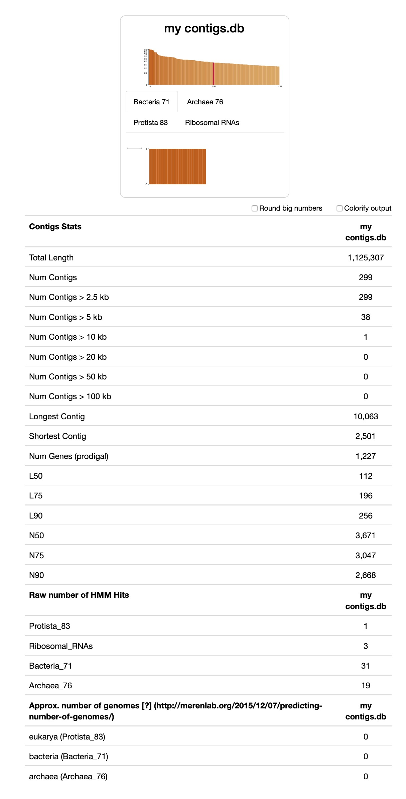

# Anvi'o first use 
## After sequencing 
### Demultiplexing
I assumed the sequences were demultiplexed 

### Quality filtering 
Sample_01

```
number of pairs analyzed      : 123144
total pairs passed            : 113724 (%92.35 of all pairs)
  total pair_1 trimmed        : 0 (%0.00 of all passed pairs)
  total pair_2 trimmed        : 0 (%0.00 of all passed pairs)
total pairs failed            : 9420 (%7.65 of all pairs)
  pairs failed due to pair_1  : 1887 (%20.03 of all failed pairs)
  pairs failed due to pair_2  : 6238 (%66.22 of all failed pairs)
  pairs failed due to both    : 1295 (%13.75 of all failed pairs)
``` 

Sample_02
 
```
number of pairs analyzed      : 54290
total pairs passed            : 50222 (%92.51 of all pairs)
  total pair_1 trimmed        : 0 (%0.00 of all passed pairs)
  total pair_2 trimmed        : 0 (%0.00 of all passed pairs)
total pairs failed            : 4068 (%7.49 of all pairs)
  pairs failed due to pair_1  : 483 (%11.87 of all failed pairs)
  pairs failed due to pair_2  : 2943 (%72.35 of all failed pairs)
  pairs failed due to both    : 642 (%15.78 of all failed pairs)
```
  
Sample_03

```
number of pairs analyzed      : 184786
total pairs passed            : 173024 (%93.63 of all pairs)
  total pair_1 trimmed        : 0 (%0.00 of all passed pairs)
  total pair_2 trimmed        : 0 (%0.00 of all passed pairs)
total pairs failed            : 11762 (%6.37 of all pairs)
  pairs failed due to pair_1  : 2234 (%18.99 of all failed pairs)
  pairs failed due to pair_2  : 8059 (%68.52 of all failed pairs)
  pairs failed due to both    : 1469 (%12.49 of all failed pairs)
  
```    
files 01_QC: 

- **Sample_01-QUALITY\_PASSED\_R1.fastq**
- Sample_01-STATS.txt
- Sample_01.ini


### co-assembly with MEGAHIT
The syntax for environment variables is  ``` R1s= `ls 01_QC/*QUALITY_PASSED_R1* | python -c 'import sys; print (",".join([x.strip() for x in sys.stdin.readlines()]))'` ``` (missing parentheses in the tutorial)

**to run:** `megahit -1 $R1s -2 $R2s --min-contig-len $MIN_CONTIG_SIZE -m 0.85 -o 02_ASSEMBLY/ -t $NUM_THREADS`
with MIN\_CONTIG\_SIZE = 1000 and NUM\_THREADS = 4   
(how to choose -m ?)

some stats from the log file:

```
2020-04-28 03:09:20 - b'INFO  main_assemble.cpp             :  211 - Number of complex bubbles removed: 0, Time elapsed(sec): 0.006886'
2020-04-28 03:09:20 - b'INFO  main_assemble.cpp             :  222 - Number unitigs disconnected: 0, time: 0.007'
2020-04-28 03:09:20 - b'INFO  main_assemble.cpp             :  246 - Unitigs removed in excessive pruning: 0, time: 0.000'
2020-04-28 03:09:20 - b'INFO  assembly/contig_stat.h        :   40 - Max: 10063, Min: 142, N50: 686, number contigs: 17868, number isolated: 17600, number looped: 42, total size: 12860989,'
2020-04-28 03:09:20 - b'INFO  main_assemble.cpp             :  289 - Number of local low depth unitigs removed: 8, complex bubbles removed: 0, time: 0.011086'
2020-04-28 03:09:20 - b'INFO  assembly/contig_stat.h        :   40 - Max: 10063, Min: 142, N50: 686, number contigs: 17846, number isolated: 17605, number looped: 42, total size: 12856876,'
2020-04-28 03:09:22 - b'INFO  utils/utils.h                 :  152 - Real: 22.7105\tuser: 72.4127\tsys: 0.4891\tmaxrss: 78999552'
2020-04-28 03:09:22 - Merging to output final contigs 
2020-04-28 03:09:22 - 2052 contigs, total 3601872 bp, min 1000 bp, max 10063 bp, avg 1755 bp, N50 1756 bp
2020-04-28 03:09:22 - ALL DONE. Time elapsed: 793.728498 seconds 

```
files created in 02_CONTIGS: 

- checkpoints.txt
- done
- **final.contigs.fa**
- intermediate_contigs (folder)
- log
- options.json
- contigs.fa in 03_CONTIGS

### mapping  
Sample_01

```
113724 reads; of these:
  113724 (100.00%) were paired; of these:
    107182 (94.25%) aligned concordantly 0 times
    6538 (5.75%) aligned concordantly exactly 1 time
    4 (0.00%) aligned concordantly >1 times
    ----
    107182 pairs aligned concordantly 0 times; of these:
      730 (0.68%) aligned discordantly 1 time
    ----
    106452 pairs aligned 0 times concordantly or discordantly; of these:
      212904 mates make up the pairs; of these:
        212602 (99.86%) aligned 0 times
        294 (0.14%) aligned exactly 1 time
        8 (0.00%) aligned >1 times
6.53% overall alignment rate
```

Sample_02

```
50222 reads; of these:
  50222 (100.00%) were paired; of these:
    49361 (98.29%) aligned concordantly 0 times
    861 (1.71%) aligned concordantly exactly 1 time
    0 (0.00%) aligned concordantly >1 times
    ----
    49361 pairs aligned concordantly 0 times; of these:
      211 (0.43%) aligned discordantly 1 time
    ----
    49150 pairs aligned 0 times concordantly or discordantly; of these:
      98300 mates make up the pairs; of these:
        98232 (99.93%) aligned 0 times
        68 (0.07%) aligned exactly 1 time
        0 (0.00%) aligned >1 times
2.20% overall alignment rate
```

Sample_03 
 
```
173024 reads; of these:
  173024 (100.00%) were paired; of these:
    167900 (97.04%) aligned concordantly 0 times
    5115 (2.96%) aligned concordantly exactly 1 time
    9 (0.01%) aligned concordantly >1 times
    ----
    167900 pairs aligned concordantly 0 times; of these:
      437 (0.26%) aligned discordantly 1 time
    ----
    167463 pairs aligned 0 times concordantly or discordantly; of these:
      334926 mates make up the pairs; of these:
        334746 (99.95%) aligned 0 times
        177 (0.05%) aligned exactly 1 time
        3 (0.00%) aligned >1 times
3.27% overall alignment rate
```
files created in 04_MAPPING:

* Sample_01.bam.bai
* Sample_01.bam
* contigs.1.bt2
* contigs.rev.1.bt2


## Anvi'o User Tutorial for Metagenomic Workflow
### Create an anvi’o contigs database
>An anvi’o contigs database will keep all the information related to your contigs: positions of open reading frames, k-mer frequencies for each contigs, where splits start and end, functional and taxonomic annotation of genes, etc.    

#### anvi-gen-contigs-database
We create a contigs data base *contigs.db* with k-mers frequencies, and ORF (the program use the software **Prodigal**). This will also soft-split contigs longer than 20000pb (why?).   
files: 

- contigs.db
- mycontigs

#### anvi-run-hmms
This programm using **HMMER** will look for patterns from known sequences into our contigs using probabilistic models called profile hidden Markov models. Add hits to *contigs.db*

#### anvi-display-contigs-stats
a quick look at some of our contigs stats.    
It seems that the contigs default size is 2500 nt. 
 

#### anvi-run-ncbi-cogs
annotate genes in your *contigs.db* with functions from the NCBI’s Clusters of Orthologus Groups.
`2086 function calls from 2 sources for 1043 unique gene calls has been added to the contigs database.`

#### anvi-import-taxonomy
with **centrifuge**   
"However, gene-level taxonomy is not reliable for making sense of the taxonomy of the resulting metagenome-assembled genomes."

```
Num gene caller ids in the db ................: 1,230
Num gene caller ids in the incoming data .....: 1,048
Taxon names table ............................: Updated with 36 unique taxon names
Genes taxonomy table .........................: Taxonomy stored for 1048 gene calls
Splits taxonomy ..............................: Input data from "centrifuge" annotated 283 of 299 splits (94.6%) with taxonomy. 
```
files created: 

- centrifuge_hits.tsv
- centrifuge_report.tsv
- gene_calls.fa 

### Profiling BAM files
#### anvi-profile
In contrast to the contigs database, an anvi’o profile database stores sample-specific information about contigs.
  
- contigs coverage stats for each contigs
- nt coverage. By default, the profiler will not pay attention to any nucleotide position with less than 10X coverage

files created :

* SAMPLE\_01.bam-ANVIO_PROFILE
  * AUXILIARY-DATA.db
  * PROFILE.db
  * RUNLOG.txt

### Working with anvi'o profile
#### anvi-merge
Merge all anvi’o profiles

files created in SAMPLE-MERGED: 

- AUXILIARY-DATA.db
- PROFILE.db
- RUNLOG.txt

#### anvi-cluster-contigs 
[Visualizing the fate of contigs across metagenomic binning algorithms](http://merenlab.org/2020/01/02/visualizing-metagenomic-bins/) a post by A. Murat Eren (Meren) and Jarrod J. Scott

It is a program that enables anvi’o to run multiple binning algorithms on your data and seamlessly import the results into your profile database to compare. 

- maxbin2: FragGeneScan can not be used on mac os system
- metabat2: failed to run 
- concot: failed to install 
- binsanity: formed 1 clusters, which is being added to the database as a collection named collection.

### anvi-interactive


### anvi-summarize
collection summary: [Index](index.html)


