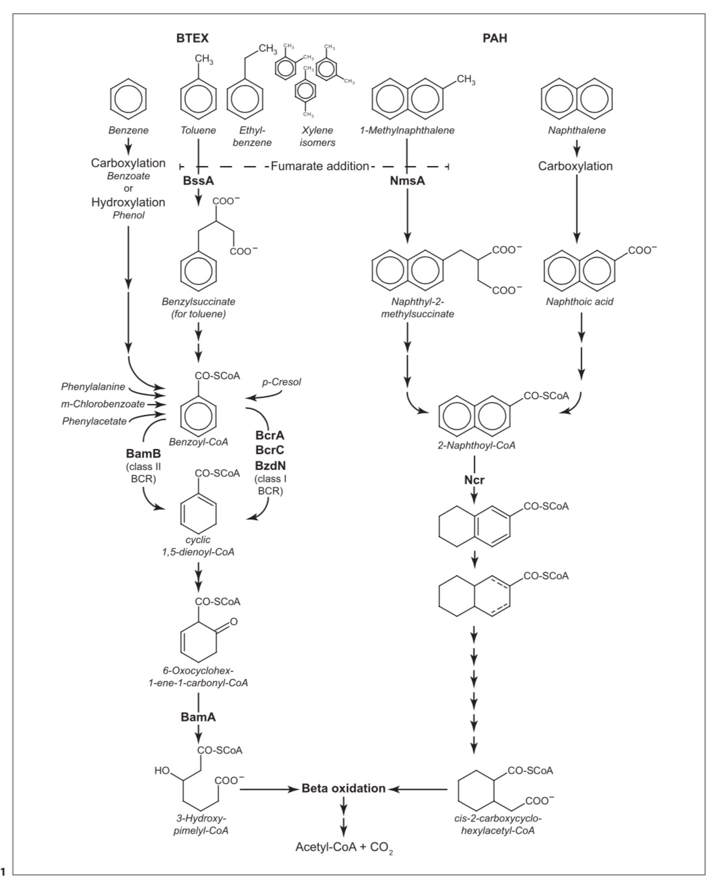

# Bibliography 

#### Lu, L., Yazdi, H., Jin, S., Zuo, Y., Fallgren, P.H., Ren, Z.J., 2014. Enhanced bioremediation of hydrocarbon-contaminated soil using pilot-scale bioelectrochemical systems.
 
in *Journal of Hazardous Materials* 274, 8–15.  
<https://doi.org/10.1016/j.jhazmat.2014.03.060>   

##### Abstract:
>Two column-type bioelectrochemical system (BES) modules were installed into a 50-L pilot scale reactor packed with diesel-contaminated soils to investigate the enhancement of passive biodegradation of petroleum compounds. By using low cost electrodes such as biochar and graphite granule as non-exhaustible solid-state electron acceptors, the results show that 82.1–89.7% of the total petroleum hydrocarbon (TPH) was degraded after 120 days across 1–34 cm radius of influence (ROI) from the modules. This represents a maximum of 241% increase of biodegradation compared to a baseline control reactor. The current production in the BESs correlated with the TPH removal, reaching the maximum output of 70.4 ± 0.2 mA/m2 . The maximum ROI of the BES, deducting influence from the baseline natural attenuation, was estimated to be more than 90 cm beyond the edge of the reactor (34 cm), and exceed 300 cm should a non-degradation baseline be used. The ratio of the projected ROI to the radius of BES (ROB) module was 11–12. The results suggest that this BES can serve as an innovative and sustainable technology for enhanced in situ bioremediation of petroleum hydrocarbons in large field scale, with additional benefits of electricity production and being integrated into existing field infrastructures. 

##### My notes:
- The objective is to test the effectiveness of 2 BES designs and granulated graphite and biochar as anode material on TPH and n-alkane remediation, by measuring [TPH], [n-alkane] along distance.  
- Soil samples were collected, sieved and partially air dried. **why?**.  
- Analytical methods are well described.

#### Megonigal, J.P., Hines, M.E., Visscher, P.T., 2014. Anaerobic Metabolism: Linkages to Trace Gases and Aerobic Processes

in *Treatise on Geochemistry.* Elsevier, pp. 273–359.  
<https://doi.org/10.1016/B978-0-08-095975-7.00808-1.>
##### My notes:  
A good review about anaerobic metabolisms.

#### Abbasian, F., Lockington, R., Mallavarapu, M., Naidu, R., 2015. A Comprehensive Review of Aliphatic Hydrocarbon Biodegradation by Bacteria.
In *Appl Biochem Biotechnol* 176, 670–699.   
<https://doi.org/10.1007/s12010-015-1603-5>

##### Abstract:
>Hydrocarbons are relatively recalcitrant compounds and are classified as high-priority pollutants. However, these compounds are slowly degraded by a large variety of microorganisms. Bacteria are able to degrade aliphatic saturated and unsaturated hydrocarbons via both aerobic and anaerobic pathways. Branched hydrocarbons and cyclic hydrocarbons are also degraded by bacteria. The aerobic bacteria use different types of oxygenases, including monooxygenase, cytochrome-dependent oxygenase and dioxygenase, to insert one or two atoms of oxygen into their targets. Anaerobic bacteria, on the other hand, employ a variety of simple organic and inorganic molecules, including sulphate, nitrate, carbonate and metals, for hydrocarbon oxidation.

##### My notes:
- ***Anaerobic HC biodegradation***
	- **Denitryfing bacteria:** degrade different aliphatic and aromatic hydrocarburs at the expense of nitrate reduction  
	- **Sulfate reducing microorganism:** Use sulfate as a terminal electron acceptor to oxydise organic compounds  
	- **Metal-Oxidising Microorganisms**  
	- **Intraaerobic Anaerobes:** This category of microorganisms are able to extract oxygen from chlorate, perchlorate, nitric oxide (NO) or nitrate in order for it to be utilised as an electron acceptor  
	- **Methanogenesis:** Several anaerobic microorganisms are able to mineralise hydrocarbons to methane as part of microbial syntrophic consortia. Such a consortium can be seen in the syntrophic relationship between methanogenic archaea and hydrogen-producing bacteria for the degradation of aromatic hydrocarbons to methane and CO2. H2 is used for the reduction of CO2 into CH4.  
	- **Anoxygenic Sulphate-Dependent Phototrophic Bacteria**
- ***The Biochemistry of Anaerobic Hydrocarbon Biodegradation***
	- **Fumarate addition:** Described in von Netzer et al.  
	- **Oxygen independent hydroxilation**  
	- **Carboxylation**

#### von Netzer, F., Kuntze, K., Vogt, C., Richnow, H.H., Boll, M., Lueders, T., 2016. Functional Gene Markers for Fumarate-Adding and Dearomatizing Key Enzymes in Anaerobic Aromatic Hydrocarbon Degradation in Terrestrial Environments. 

In *J Mol Microbiol Biotechnol* 26, 180–194.  
<https://doi.org/10.1159/000441946>
##### Abstract:
> Anaerobic degradation is a key process in many environments either naturally or anthropogenically exposed to petroleum hydrocarbons. Considerable advances into the biochemistry and physiology of selected anaerobic degraders have been achieved over the last decades, especially for the degradation of aromatic hydrocarbons. However, researchers have only recently begun to explore the ecology of complex anaerobic hydrocarbon degrader communities directly in their natural habitats, as well as in complex laboratory systems using tools of molecular biology. These approaches have mainly been facilitated by the establishment of a suite of targeted marker gene assays, allowing for rapid and directed insights into the diversity as well as the identity of intrinsic degrader populations and degradation potentials established at hydrocarbon-impacted sites. These are based on genes encoding either peripheral or central key enzymes in aromatic compound breakdown, such as fumarate-adding benzylsuccinate synthases or dearomatizing aryl-coenzyme A reductases, or on aromatic ring-cleaving hydrolases. Here, we review recent advances in this field, explain the different detection methodologies applied, and discuss how the detection of site-specific catabolic gene markers has improved the understanding of processes at contaminated sites. Functional marker gene-based strategies may be vital for the development of a more elaborate population-based assessment and prediction of aromatic degradation potentials in hydrocarbon-impacted environments.

##### My notes:
- **Catabolic pathway**  
Fumarate addition is involved in aromatic but also in non aromatic HC degradation.
the genes of FAEs can be considered as widely applicable catabolic markers for anaerobic hydrocarbon degradation in the environment.
 
- **Anaerobic degraders**   
Rhodocyclaceae (Betaproteobacteria), Geobacteraceae, Desulfobacteraceae, Syntrophobacteraceae (Deltaproteobacteria) and Peptococcaceae (Clostridia)
Betaproteobacteria (especially Thauera and Azoarcus strains) are recognized as key organisms for BTEX degradation under nitrate-reducing conditions (Some anaerobic degraders use denitrification to oxydise and activated HC). They activate toluene or xylene isomers by fumarate addition and ethylbenzene by anaerobic hydroxylation of the side chain. Also been reported as secondary degraders in benzene enrichment cultures.  
Sulphate reducing Deltaproteobacteria can mineralize BTEX and PAH.
Geobacter (belong to the Deltaproteobacteria)...

#### Jin, S., Fallgren, P.H., 2014. Feasibility of Using Bioelectrochemical Systems for Bioremediation, 
in *Microbial Biodegradation and Bioremediation.* Elsevier, pp. 389–405.  
<https://doi.org/10.1016/B978-0-12-800021-2.00016-9>  

##### Abstract:
>Bioelectrochemical systems (BESs) are a category of biologically based technologies that combine biological, primarily microbial and enzymatic, pathways with electrochemical enhancement to complete biochemical reactions and generate energy or chemical products. This chapter focuses on the application of one type of BES, the microbial fuel cell, for bioremediation. Different types of BES have been investigated in bioremediation applications for a wide range of environmental contaminants. BES is composed of anodes and cathodes, and different reactions occur at each electrode type, which can be applied to remediation. Oxidation processes (e.g., hydrocarbons and other contaminants of lower oxidizing potentials) can occur at the anode, while reduction processes (e.g., chlorinated hydrocarbons and other contaminants of higher oxidizing potentials) occur at the cathode. Based on results from laboratory and field-scale studies, BES demonstrates its feasibility and emerges as a novel and sustainable remediation technology.
The monitoring of electrical current in BES used in remediation, offers a continuous monitoring of microorganisms activities.

##### My notes:
- **BES designs:**  
Two-chamber BESs tend to be favored for remediation research where the degradation of specific waste is usually examined individually in anodic or cathodic chambers for oxidative or reductive reactions, respectively.     
In anodic biodegradation studies, a typical design is a two-chamber BES. se expensive and unstainable cathode materials to catalize the oxydation occuring at the cathode.
- **Microbiology and mediators**
Bacterias can use the electrons from he cathode for dissimilatory reduction and some have been identified.   
The electrons can transfer to the anode via redox components located on the outer surface of the microorganism (e.g., cytochromes, pilus-like appendages) (like *Geobacter spp*) and  mediated electron transfer based on diffusible redox mediators, electroactive substrats, or humic substances).  
Little is known about the biochemical mechanisms of microbial electron uptake from a cathode.  
antraquinone-2,6-disulfonate (AQDS) and methyl viologen (MV) are electrons mediators often encountered in bioremediation studies.   
Some electroactive substances such as quinones, phenazines, humic substance, can be used by either electron donors and electron acceptors. Addition of mediators to the substrates may not be a good idea. It raises the cost, and recquire additional treatment to remove this coumpounds from the treated environment. 
- **Potential and power supply**  
An optimal applied potential can provide an appropriate selective pressure for adaptation of microorganisms, promote enrichment of the biofilm, reduce the startup time of the system, and increase the subsequent power density due to better acclimation of the exoelectrogenic bacteria.

# Glossary
- **Bioelectrical system (BES)**: In these systems, a potential difference between two electrodes is created because of the redox potentials of an oxidation reaction at the anode and a reduction reaction at the cathode.
  Devices that employ microbes as catalysts to convert chemical energy stored in organic matter into sustainable electricity and high-value chemicals.  
- **Microbial Fuel Cell (MFC)**: BES with electro-active bacterias at the anode. The final objective is to produce electricity
- **Microbial Electrolysis Cell (MEC)**: adding power to a MFC. The final objective is to produce value-added chemical compounds
- **Fumarate Adding Enzyme (FAE)**: FAE are enzymes commonly found for anaerobic activation of hydrocarbons. 
- **BTEX:** Benzene Toluene Ethyl-benzene Xylene