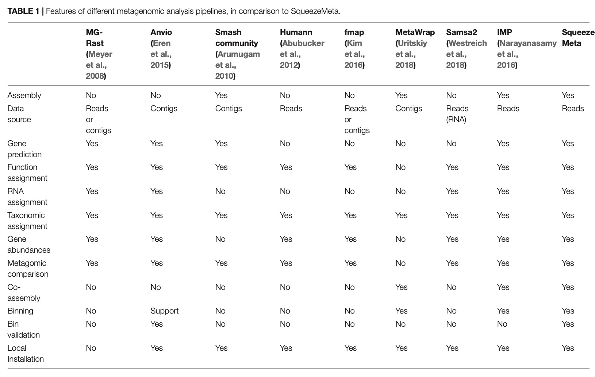

# Metagenomic Analysis
Quince, C., Walker, A.W., Simpson, J.T., Loman, N.J., Segata, N., 2017. **Shotgun metagenomics, from sampling to analysis.** Nat Biotechnol 35, 833–844. <https://doi.org/10.1038/nbt.3935>
> **Abstract:** Diverse microbial communities of bacteria, archaea, viruses and single-celled eukaryotes have crucial roles in the environment and in human health. However, microbes are frequently difficult to culture in the laboratory, which can confound cataloging
of members and understanding of how communities function. High-throughput sequencing technologies and a suite of computational pipelines have been combined into shotgun metagenomics methods that have transformed microbiology. Still, computational approaches to overcome the challenges that affect both assembly-based and mapping-based metagenomic profiling, particularly of high-complexity samples or environments containing organisms with limited similarity to sequenced genomes, are needed. Understanding the functions and characterizing specific strains of these communities offers biotechnological promise in therapeutic discovery and innovative ways to synthesize products using microbial factories and can pinpoint the contributions of microorganisms to planetary, animal and human health.

- Microbial content can vary across samples from the same environment, which complicates the detection of statistically significant and biologically meaningful differences among small sets of samples. 
- The pre-screening of the data with 16S RNA sequencing can give information on the power of calculation of a shotgun analysis of the same data.  
- Sampling, conservation protocols can affect the results of the analysis. 
- Mechanical lysis seems better than chemical lysis for DNA extraction but it can result in short-ended DNA.
- Metagenomic sequences from different samples can be processed at once with barcode. 
- **Library preparation**: first step of NGS, allow the sample to be identified during the fixation of the DNA to the sequencing flowcell. There is 2 methods : fragmentation and tagmentation.
- **Metagenomic assembly**: Because sequencer can only read short sequences, it is necessary to assemble the reads in order to reconstruct the original sequence. Overlapping reads are merged in contigs. Bruijn graph consit in overlapping k-mers to reconstruct genomes. Sequence coverage is often not uniforme, and depends on the abundance of this sequence into the sample. Assembly is complicated by sequencing errors and repeptitives sequences.     
Assembly can be done with *Megahit* or *SPAdes*.
- ...

# data treatment after sequencing 
see [merenlab tutorial](http://merenlab.org/tutorials/assembly-based-metagenomics/)

- **demultiplexing:**  sorting the sequences into separated reads following their barcode. 
- **quality filtering**
- **assambly** 
- **mapping:** refers to the process of aligning short reads to a reference sequence, whether the reference is a complete genome, transcriptome, or de novo assembly. Generate BAM files. 

# pipelines
## pipelines features
 from Tamames, J., Puente-Sánchez, F., 2019. SqueezeMeta, A Highly Portable, Fully Automatic Metagenomic Analysis Pipeline. Front. Microbiol. 9, 3349

## HUMAnN2
[user manual](https://github.com/biobakery/humann)
### Initial installation 
too much troubles

I tried a few times to install humann2 on Mac OSX.
I followed the tutorial that is on the Github page.

#### steps that I followed and the errors that ensued:
I downloaded humann2 from pip as follow: `pip install humann2 --no-binary :all:`

I tried to run a demo using the following command: `humann2 --input examples/demo.fastq --output $OUTPUT_DIR`.  
Even when doing this I am still getting the following error: `CRITICAL ERROR: The bowtie2 executable can not be found. Please check the install.`

It looks like even when downloading from the source it still did not find the essential software.

I installed bowtie2 manually following the steps in their website:
- download the source code (by paying attention that the version is compatible with humann2)
- brew install tbb

The previous error got resolved but instead this time it was: `CRITICAL ERROR: The diamond executable can not be found.`

Installing diamond have been fruitless as well with the same critical error but I was able to resolve that error by downloading an old version of diamond (v0.8.22)

But now I have a critical error saying: `CRITICAL ERROR: metaphlan2 executable can not be found`

However when doing the following command: `metaphlan2.py —version` it looks it is defined and accessible within the path.

Trying to get older versions of metaphlan2 or Humann2 did not solve the issue.

Metaphlan database in the metaphlan folder is empty. 

## Squeeze meta 
[github] (https://github.com/jtamames/SqueezeMeta)  
 
Tamames, J., Puente-Sánchez, F., 2019. **SqueezeMeta, A Highly Portable, Fully Automatic Metagenomic Analysis Pipeline.** Front. Microbiol. 9, 3349. <https://doi.org/10.3389/fmicb.2018.03349>

### installation 
only on Linux 

## anvi'o
### installation
[installation](http://merenlab.org/2016/06/26/installation-v2/)  
First activate conda, and then the Python environment within the conda env:
`conda activate anvio-master`
`anvi-activate-master`

### tutorial for metagenomic workflow 
[tuto] (http://merenlab.org/2016/06/22/anvio-tutorial-v2/)
