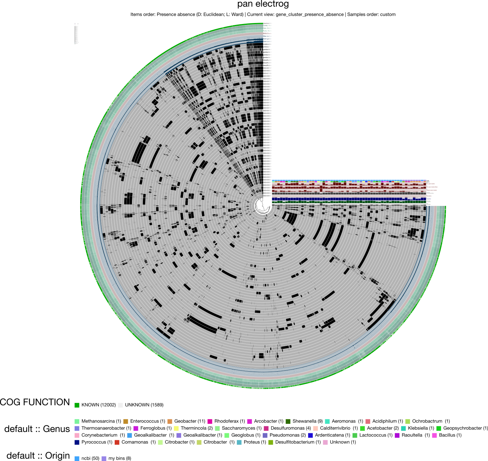
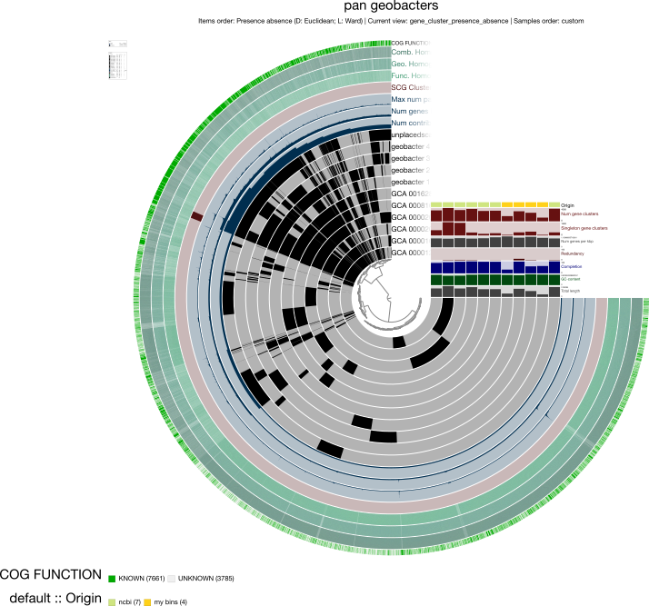
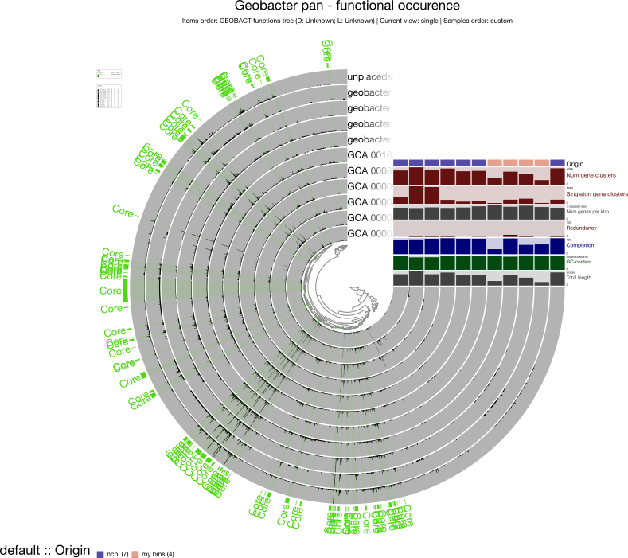

# An anvi'o workflow for microbial pangenomics

### Downloading sequences from NCBI command line
<https://www.ncbi.nlm.nih.gov/datasets/docs/command-line-assembly/> 
`./datasets download assembly --inputfile GCA_all.txt --filename electrogensDB_test1.zip`

### Retrieve all .fna files from electrogensDB_test1 subdirectories and move them to a new folder
* `mkdir fna_folder`
* `find . -name '*.fna' -exec mv {} /path/to/single/target/directory/ \;`

They are in `./zee/biodatabase/electrogensDB_test1`. (should copy next time, it is risky to move files...)

### Generating an anvi’o genomes storage
A database storing specific information about the genomes, whether they are fasta files (external) or bins (internal).

#### Create an "external" genome storage
`anvi-script-FASTA-to-contigs-db` is a script to quickly build contigs from a fasta file: 
`for file in fna/*.fasta; do anvi-script-FASTA-to-contigs-db $file ; done`

external-genomes.txt is a file with the sequence names and the name.db with the headers **name** and **contigs\_db_path**

- `find . -name '*.fasta'`
- `find . -name '*.db'`
- Copy and paste the results to excel.
-  Now remove the .\ in each lines: `sed 's/.\///g' external-genomes.txt`
- And the " .fasta": `sed 's/.fasta//' external-genomes.txt`
- Copy paste to excel. Export as external-genomes.txt 


#### Create an "internal" genome storage
Make a tab file with **name	bin\_id	collection\_id profile\_db_path contigs\_db\_path** as headers. 

#### functional annotation 
`for file in contigs_ext/*.db; do anvi-run-ncbi-cogs -c $file; done`


### Running a pangenomic analysis   
The pangenomic workflow first identifies amino acid sequences that are somewhat similar by doing similarity searches, and then resolves gene clusters based on those similarities.

`anvi-pan-genome -g electrogensXanodes-GENOMES.db -n "pan_electrog" -T 7 --min-occurrence 3`
I set the minimum occurence at 3, to get rid of genes occuring only once and twice in our genomes database, because otherwise :    
```
It seems you have 97,487 gene clusters in your pangenome. 
This exceeds the soft limit of 20,000 for anvi'o to attempt to create a hierarchical clustering of your gene clusters (which becomes the center tree in all anvi'o displays).
```

#### add additional layers information (such as the genus)
- make a tab file with the genomes names, and the additional information. 
- Save it as a tab delimited text file in excel
- copy paste in a new texedit file, and save it as .txt (otherwise anvi'o will say "`The probability that layers_additional_data.txt\ is a tab-delimited file is zero.`
The genus additional layer will allow us to make a pangenomic analysis focusing on a specific genus: `anvi-pan-genome -g electrogensXanodes-GENOMES.db -G geobacters.txt -T 7 -n "pan-geobacters"`

#### split the pangenome
`anvi-split -p pan-geobacters/pan-geobacters-PAN.db -g electrogensXanodes-GENOMES.db -C geobacters_collection -o SPLIT_GEOBACT ` splitted the pangenomes into multiple independent pangenomes based on the bins stored in geobacters_collection 


**the pangenomics analysis:**



#### Making sense of functions in my pangenome
Let's see if geobacters MAGS have specific functions compared to geobacters from the exoelectrogenic db. 

- Make a pangenomic analysis for geobacter only  `anvi-pan-genome -g electrogensXanodes-GENOMES.db -G geobacters.txt -T 7 -n "pan-geobacters"`
**the geobacter pangenomics analysis:**

- add an additional layers information for origin (ncbi/mybins)
- `anvi-get-enriched-functions-per-pan-group` allows to create a TAB-delimited file with the frequency of occurrence information for functions in genomes (i.e. how many genes in a genome were associated with each function).
**the geobacter functional occurence pangenomics analysis:**



